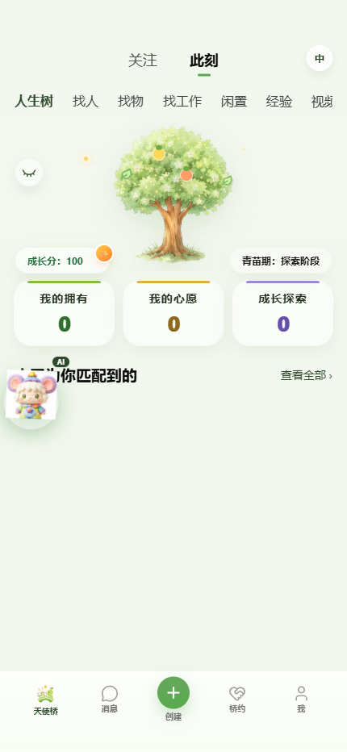
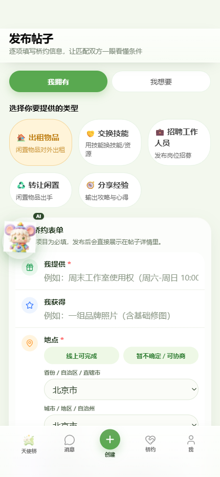
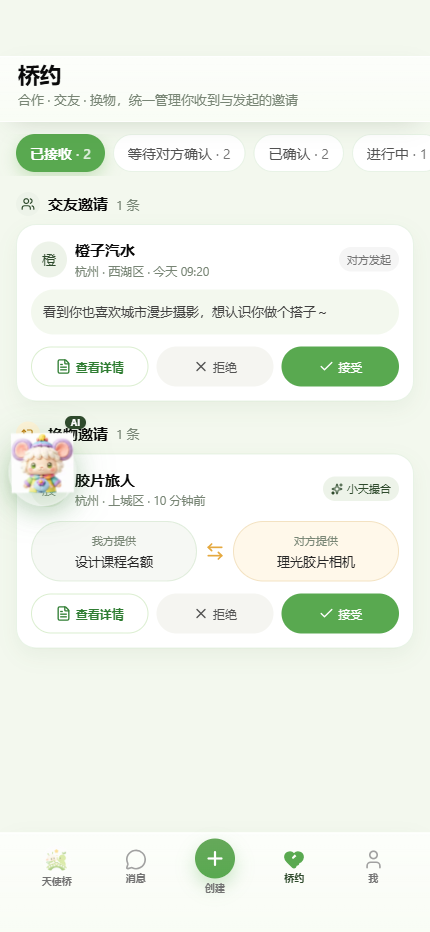
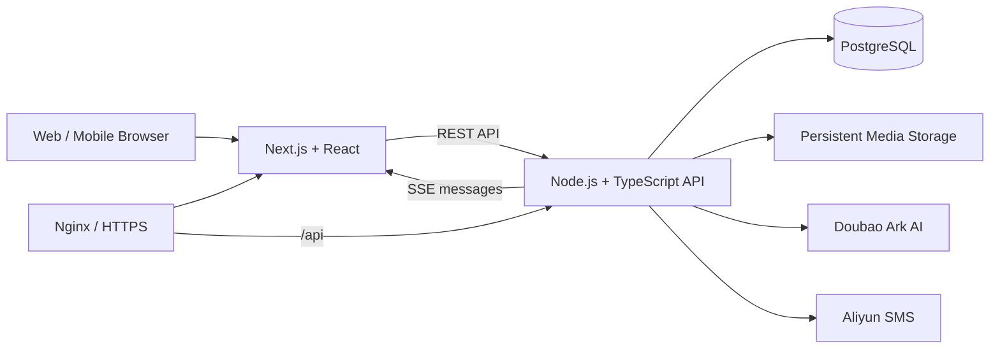

# 天使桥 AngelBridge

> 让 AI 理解每个人拥有的资源、能力与愿望，促成双向有益、可以真正开始的现实连接。

[在线体验](https://angel.xxpeople.com/) · [项目展示页](https://violet-yui.github.io/AngelBridge/) · [产品文档](docs/README.md)

天使桥是一个 AI 原生的价值匹配与互助平台。用户不必在信息流中反复搜索，而是自由表达“我拥有什么、需要什么、愿意如何交换”；个人 AI 伙伴“小天”会整理意图、寻找互补对象、解释匹配依据，并帮助双方把共识转化为可执行的“桥约”。

## 核心闭环

1. **表达价值**：通过个人档案、人生树或发布表单描述资源、能力、需求与目标。
2. **AI 整理**：小天将自然语言整理为结构化价值节点和可匹配条件。
3. **可解释匹配**：系统结合语义理解、双向价值、约束与执行度，给出匹配度和 1–3 条理由。
4. **双方确认**：双方分别接受连接后进入真实会话，继续补充条件。
5. **生成桥约**：明确第一步行动、完成标准和退出方式，双方确认开始与完成。
6. **沉淀成长**：完成结果回到人生树，并形成可持续积累的成长记录。

## 产品预览

以下截图由 OpenCLI 控制 Edge 访问[真实生产环境](https://angel.xxpeople.com/)采集；点击图片可直接打开对应线上页面。

| 人生树与价值入口 | AI 匹配与发现 |
| --- | --- |
| [](https://angel.xxpeople.com/) | [](https://angel.xxpeople.com/discover) |

| 发布真实意图 | 桥约履约闭环 |
| --- | --- |
| [](https://angel.xxpeople.com/create) | [](https://angel.xxpeople.com/bridge) |

## 已实现能力

- 手机号验证码注册登录，并提供隔离的现场展示账号。
- 个人资料、头像、人生树和“拥有 / 心愿 / 探索”标签持久化。
- 图片发布与小天自然语言整理，多用户进入真实共享匹配池。
- 豆包语义评估与后端约束评分结合的可解释匹配。
- 双方独立确认、桥约条款、开始确认、完成确认与成长值变化。
- PostgreSQL 持久化聊天，SSE 实时推送消息、未读状态和图片消息。
- Docker Compose + Nginx 单机部署，生产环境 HTTPS 同源访问。

## 系统架构



后端保持单实例、单 PostgreSQL 的黑客松架构。认证身份、匹配快照、聊天、桥约和成长状态均可在容器重启后恢复；上传文件使用独立持久化目录。

## 技术栈

| 层级 | 技术 |
| --- | --- |
| 前端 | Next.js 16、React 19、TypeScript、Tailwind CSS、Zustand |
| 后端 | Node.js、TypeScript、原生 HTTP API、SSE、Zod |
| 数据 | PostgreSQL 16、文件持久化存储 |
| AI 与通信 | 豆包 Ark、阿里云短信 |
| 部署 | Docker、Docker Compose、Nginx、HTTPS |
| 质量 | Vitest、TypeScript 类型检查、Fixture 校验 |

## 本地开发

### 后端

```bash
npm install
cp .env.example .env
node --env-file=.env --import tsx scripts/migrate-db.ts
node --env-file=.env --import tsx scripts/run-api.ts
```

后端默认监听 `http://127.0.0.1:8787`，健康检查为 `GET /api/health`。以上命令使用 Node.js 20.6+ 的 `--env-file` 加载本地配置；运行迁移前，请在 `.env` 中配置 PostgreSQL。真实 AI 和短信登录需要各自的服务端凭证。所有密钥只保存在本地或部署环境中，不要提交到仓库。

### 前端

```bash
cd frontend-final
npm install
npm run dev
```

前端默认使用同源 `/api`。分离运行前后端时，可在 `frontend-final/.env.local` 中设置：

```dotenv
NEXT_PUBLIC_API_BASE_URL=http://127.0.0.1:8787
```

### 验证

```bash
npm run typecheck
npm test
npm run verify:fixtures

cd frontend-final
npm run build
```

## 项目结构

```text
frontend-final/   当前生产前端与页面资源
src/              认证、AI、匹配、聊天、桥约、媒体与 HTTP API
database/         PostgreSQL migrations 与种子数据
tests/            领域、API、持久化和完整闭环测试
scripts/          本地运行、迁移、Fixture 与演示脚本
docs/             产品、工程、算法、部署与路演资料
```

## 延伸阅读

- [文档索引](docs/README.md)
- [黑客松 MVP PRD](docs/product/天使桥_黑客松MVP_PRD.md)
- [匹配度算法说明](docs/engineering/天使桥_匹配度算法说明.md)
- [双账号完整演示方案](docs/engineering/天使桥_双账号完整演示方案.md)

## 项目理念

传统平台优化的是曝光、点击与停留时长；天使桥关注的是：**价值是否真正流动，连接是否让双方的愿望向现实推进了一步。**
