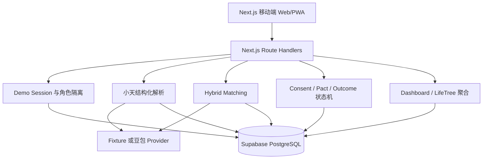

# 天使桥｜结合前端 MVP 稿与产品生命树稿的后端实现与部署方案

> 文档性质：后端实施与部署规格，不重新设计页面视觉。  
> 适用范围：黑客松合成数据 MVP。  
> 技术负责人席位：后端 / AI 开发。  
> 数据声明：本次人物、资源、位置、距离、匹配、桥约和成长记录全部为合成演示数据。  
> 关联文档：[MVP PRD](../product/天使桥_黑客松MVP_PRD.md)｜[匹配度算法](天使桥_匹配度算法说明.md)｜[灵宠语音接口](天使桥_灵宠语音接口与联调说明.md)

---

## 1. 结论与后端实施口径

两套设计稿承担不同职责：

- **前端 MVP 稿**定义一次价值置换如何完成，是服务端状态机和 API 的第一依据；
- **产品生命树稿**定义个人价值档案如何汇总和展示，是生命树聚合接口的补充依据；
- 两套稿件出现冲突时，黑客松阶段以“能完成一条可验证闭环”为优先，不实现社区信息流和泛化人生档案。

统一后的产品主线是：

```text
此刻查看当前愿望
→ 与小天对话
→ 确认 Offer / Need / Exchange / Constraints / Boundary
→ 小天进行双向匹配
→ 查看一座桥及 Match Proof
→ A、B 分别表达意愿
→ 自动形成桥约草稿
→ A、B 分别确认桥约
→ 桥约生效并完成第一步
→ 完成或退出
→ Outcome 写回生命树
```

后端实施遵循四个原则：

1. 页面只展示后端状态，不能在客户端伪造“双方已确认”或“桥约已生效”；
2. AI 负责自然语言理解和语义匹配，固定代码负责硬条件、评分换算和状态变更；
3. 所有推荐必须同时说明双方分别获得什么；
4. Fixture 与真实 AI 使用相同合同，但运行模式和合成数据标识必须显式返回。

## 2. 两套设计稿的完整页面读取记录

### 2.1 前端 MVP 稿：八个页面

| 序号 | 页面 | 图片中实际承载的内容 | 对后端的要求 |
|---|---|---|---|
| F1 | 此刻首页 | 小天状态；“用周末工作室换一组品牌照片”的当前愿望；三个候选桥；匹配度；时间、地点、交换内容待办 | 聚合当前 Intent、Top 3、待办、灵宠状态；待办必须关联具体 Match 或 Pact |
| F2 | 和小天说 | 多轮文字对话；询问可用时间、位置公开程度、交换方式；整理 Offer、Need、Boundary | 对话输入解析为结构化草稿；模型输出须经 Zod；草稿未确认前不写成有效 Intent |
| F3 | 意图确认 | Offer、Need、Exchange、Constraints、Boundary 五段确认；“让小天去搭桥” | 保存节点编辑、约束和边界；至少一个 Offer 和一个 Need；激活 Intent |
| F4 | 小天搭桥 | 识别意图、寻找 Offer、检查双方收益、生成理由；双向 Need/Offer 图；三个候选 | 运行 Hard Gate 和 Hybrid Match；返回进度阶段、双向价值、候选排序和算法元数据 |
| F5 | 一座桥 | 双方各自分享什么；你获得什么、对方获得什么；为什么适合；未知项；第一步；“我愿意了解对方” | 返回完整 Match Proof；提交当前角色 Consent；不得自动代表对方同意 |
| F6 | 双方确认 | A 已同意、B 确认中；将开放与仍保护的信息；继续生成桥约 | 返回双方独立状态；第二方未同意时 CTA 必须禁用；互相同意后自动创建 Pact Draft |
| F7 | 桥约 | 我提供、我获得、地点、第一次行动、完成标准、退出方式；双方确认后生效 | Bridge Pact 持久化；A/B 分别确认；只有两方都确认才能进入 `active` |
| F8 | 生命树 | 我拥有、我需要、已完成的桥、新增联系人、场地素材、信任记录；开启下一个愿望 | 聚合 Value Node、Outcome 和完成的 Pact；成长内容必须来自已完成 Outcome |

前端稿内部需要后端和前端共同修正的一处内容错误：F1–F3 的主演示是“工作室换品牌摄影”，但 F4 一度写成“品牌拍摄空间与品牌曝光”。后端只保留 PRD 已冻结的主演示事实：

```text
A Offer：周末两天工作室使用权
A Need：一组品牌照片与基础修图
B Offer：品牌摄影与基础修图
B Need：周末室内拍摄空间
```

### 2.2 产品稿：两个人生树页面

| 序号 | 页面 | 图片中实际承载的内容 | 对后端的要求 |
|---|---|---|---|
| P1 | 人生树概览 | 灵宠；树与生命阶段；成长分；“我的拥有、我的心愿、发现机会”计数；候选合集；待确认事项；隐私模式 | 提供 Dashboard/LifeTree Overview 聚合；灵宠文案和待办根据服务端阶段派生；成长分标明 Demo 规则版本 |
| P2 | 人生树详细模式 | 拥有与需要的多类资料；树的叶片/果实；灵宠反馈；节点编辑；整体可见范围；好远包、匹配项 | 提供 Tree Detail、节点编辑和整体公开模式；MVP 只返回 Value Node，不实现年龄、财富、婚恋等真实敏感档案 |

产品稿中的“找人、找物、资源、闲置、经验、视频”等频道不进入本次后端；“好远包”“果实数量”“成长分 1000”只能作为合成 Demo 派生字段，不能作为真实资产或能力评价。

## 3. 统一后的后端架构



黑客松部署使用单仓单体，不拆微服务：

- 前端：Next.js App Router；
- HTTP 后端：Next.js Route Handlers；
- 领域逻辑：当前 `src/domain`、`src/ai-matching`、`src/demo`、`src/product`、`src/voice`；
- 持久化：Supabase PostgreSQL；
- AI：Fixture 或一个豆包方舟模型；
- 双端同步：P0 使用 2 秒轮询；
- 部署首选：Vercel + Supabase；
- 备选：七牛云 QVM + Supabase。

## 4. 服务端状态机

### 4.1 Intent 状态

```text
draft → active
```

- `draft`：AI 已生成草稿，但用户仍可编辑 Offer、Need、约束和边界；
- `active`：用户确认后允许匹配；
- 已激活 Intent 在 P0 中不继续编辑；需要修改时创建新草稿或重置 Session。

### 4.2 Match 与 Consent 状态

```text
candidate
→ waiting_other
→ mutual_accepted

candidate / waiting_other
→ rejected
```

- F5 点击“我愿意了解对方”只提交当前角色的 `accepted`；
- 第一方接受后为 `waiting_other`；
- 第二方接受后为 `mutual_accepted`；
- 任意一方拒绝后为 `rejected`；
- 已终止状态不可重复提交决定。

### 4.3 Bridge Pact 状态

```text
draft → active → completed
               ↘ exited
```

- `mutual_accepted` 后服务端自动创建 `draft`，F6 的按钮应改为“查看桥约草案”；
- A/B 分别确认 Pact；
- 两方都确认后服务端自动进入 `active`；
- 只有 `active` 可以完成或退出；
- `completed` 和 `exited` 都生成 Outcome，但生命树反馈不同。

### 4.4 页面阶段映射

| 服务端阶段 | F1 此刻 | F5 一座桥 | F6 双方确认 | F7 桥约 | F8/P1 生命树 |
|---|---|---|---|---|---|
| `created` | 提示表达愿望 | 不可进入 | 不可进入 | 不可进入 | 展示初始节点 |
| `intent_active` | 显示当前愿望 | 不可进入 | 不可进入 | 不可进入 | 显示激活愿望 |
| `matches_ready` | 显示候选 | 可查看和决定 | 未开始 | 不可进入 | 显示机会计数 |
| `waiting_other` | 显示等待对方 | 当前方已提交 | 显示双方状态 | 不可进入 | 显示待办 |
| `rejected` | 提示继续寻找 | 显示已拒绝 | 终止 | 不可进入 | 不新增成长 |
| `pact_draft` | 显示桥约待确认 | 只读 | 双方均接受 | 可查看/确认 | 显示进行中连接 |
| `pact_active` | 显示第一步待办 | 只读 | 已完成 | 可记录结果 | 显示进行中的桥 |
| `completed` | 显示完成 | 只读 | 已完成 | 只读 | 写入成果与成长 |
| `exited` | 显示已结束 | 只读 | 已结束 | 只读 | 写入结束经验，不写成功成果 |

## 5. 后端数据模型

### 5.1 必须持久化的实体

| 表/实体 | 关键字段 | 服务页面 |
|---|---|---|
| `demo_sessions` | `id`、`scenario_id`、`dataset_version`、`created_at`、`updated_at` | 全部页面、Demo 操作台 |
| `personas` | `id`、`session_id`、`role`、`display_name`、`avatar_url`、`tree_disclosure`、`demo_access_token` | F1、F5–F8、P1/P2 |
| `value_nodes` | `persona_id`、`direction`、`domain`、`title`、`description`、`keywords`、`deliverables`、`visibility`、`evidence_completeness`、`confirmed` | F2、F3、F8、P1/P2 |
| `intents` | Offer/Need/Goal 节点引用、交换方式、约束、边界、`status` | F1、F3、F4 |
| `matches` | `viewer_id`、`candidate_id`、`status`、`bridge_index`、`proof`、`assessment`、`score_breakdown`、模型版本 | F1、F4、F5 |
| `consents` | `match_id`、`persona_id`、`decision`、`decided_at` | F5、F6 |
| `bridge_pacts` | 双方、提供/获得、时间地点、费用、第一步、完成标准、退出规则、确认状态、`status` | F6、F7 |
| `outcomes` | `pact_id`、`persona_id`、`status`、`summary`、`tree_change`、`created_at` | F8、P1/P2 |

每条业务数据都带：

```text
is_synthetic = true
dataset_version = v1
```

### 5.2 当前合同需要补充的字段

前端稿比现有领域合同多出以下必要字段：

#### Intent

```ts
type DisclosurePolicy = {
  matchLocationPrecision: 'hidden' | 'region'
  contactDisclosure: 'after_mutual_consent'
  exactLocationDisclosure: 'after_pact_active'
}
```

`Intent` 需要补充：

- `boundaries` 或结构化 `disclosurePolicy`；
- 人数、用途等通用约束可先放入 `constraints.extra`；
- `confirmedAt` 和 `activatedAt`。

#### Bridge Pact

现有 `BridgePact` 需要补充：

- `timeWindow`；
- `locationSummary`；
- `costOrDifference`；
- `firstAction`；
- `completionCriteria[]`；
- `exitRule`；
- `confirmations` 与确认时间。

#### Match Proof

需要补充或在 API DTO 中组合：

- 当前查看者视角的 `valueToYou`；
- `valueToOther`；
- `firstAction`；
- `bridgeIndex` 与完整 `scoreBreakdown`；
- AI 的 `model`、`promptVersion`、`assessmentMode`；
- 合成数据说明。

### 5.3 不进入 MVP 数据库的产品稿资料

以下内容不进入本次数据库：

- 年龄、身体、财富、房产数量等完整人生档案；
- 婚恋状态和真实联系方式；
- “好远包”商业化资产；
- Token、充值算力和付费优先级；
- 真实信誉、身份认证和履约信用分。

产品稿中的相关内容统一以合成 `ValueNode` 代替，不单独建立敏感资料表。

## 6. 隐私与分阶段开放

隐私规则不是前端隐藏组件，而是后端返回不同视图。

### 6.1 节点可见范围

沿用：

```text
private
match_only
mutual_consent
```

- `private`：不送入匹配模型，不出现在对方响应；
- `match_only`：可用于匹配与 Match Proof；
- `mutual_consent`：匹配时只参与内部判断，双方同意后才向对方展示内容。

### 6.2 人生树整体公开模式

产品稿的整体可见范围落为：

```text
private
tree_only
summary
detailed
```

- P0 仅持久化选择并返回对应模式；
- 当前用户始终可查看自己的完整 Tree Detail；
- 对方查看时由服务端按模式裁剪字段。

### 6.3 连接阶段开放规则

| 阶段 | 对方可以看到 | 仍然保护 |
|---|---|---|
| 候选阶段 | 昵称、区域、相关 Offer/Need 摘要 | 联系方式、具体门牌、无关节点 |
| `waiting_other` | 与候选阶段相同 | 对方未同意前不增加信息 |
| `mutual_accepted` | 双方同意开放的昵称、区域、基础联系方式 | 详细地址 |
| `pact_active` | 桥约执行必需的时间地点信息 | 与桥约无关的个人资料 |

建议由单一函数生成对方视图：

```text
buildDisclosureView(viewerPersonaId, targetPersonaId, matchState, pactState)
```

前端不能通过更换 URL 或 persona ID 获得更高可见级别。

## 7. API 清单与页面映射

### 7.1 统一响应

```ts
type ApiResponse<T> = {
  data: T | null
  meta: {
    sessionId?: string
    mode: 'fixture' | 'live_ai'
    isSynthetic: true
    datasetVersion: string
  }
  error: {
    code: string
    message: string
  } | null
}
```

所有角色相关请求携带 Demo 角色令牌，例如：

```text
X-Demo-Role-Token: <opaque token>
```

该令牌只用于隔离 A/B 演示身份，不建立正式用户系统。

### 7.2 Demo Session

| 方法与路径 | 作用 | 返回关键字段 |
|---|---|---|
| `POST /api/demo/sessions` | 根据案例创建 Session | Session ID、A/B persona、A/B URL/token、初始阶段 |
| `GET /api/demo/sessions/:id` | Demo 操作台查看状态 | 当前阶段、双方状态、当前 Pact/Outcome |
| `POST /api/demo/sessions/:id/reset` | 恢复该案例初始状态 | 新的或重置后的 Session 状态 |

### 7.3 F1 此刻首页与 P1 人生树概览

| 方法与路径 | 作用 |
|---|---|
| `GET /api/personas/:id/dashboard` | 一次返回当前愿望、Top 3、待办、小天状态和生命树摘要 |
| `GET /api/personas/:id/inbox` | 每 2 秒轮询当前待确认和桥约变化 |

`DashboardResponse` 至少包含：

```ts
type DashboardResponse = {
  stage: DemoStage
  currentIntent: IntentSummary | null
  recommendations: RecommendationCollection
  pendingActions: PendingAction[]
  pet: PetState
  treeSummary: {
    offers: number
    needs: number
    goals: number
    opportunities: number
    outcomes: number
    growth: GrowthSummary
  }
}
```

待办必须包含 `targetId`，解决产品稿中“签约”卡片不知道属于哪座桥的问题。

### 7.4 F2 小天对话

| 方法与路径 | 作用 |
|---|---|
| `POST /api/ai/parse` | 文字输入生成 Value Node 与 Intent 草稿 |
| `POST /api/voice/turn` | 语音执行 ASR → 结构化解析 → 回复 → TTS |

`POST /api/ai/parse` 输入：

```json
{
  "sessionId": "...",
  "personaId": "...",
  "text": "我有一间周末工作室，想换一组品牌照片……"
}
```

输出复用 `ParseResult`，不得直接激活 Intent。语音接口在时间不足时保留 Fixture 音频演示，文字流程仍为 P0。

### 7.5 F3 意图确认

| 方法与路径 | 作用 |
|---|---|
| `PATCH /api/value-nodes/:id` | 修改标题、描述、交付、证据和可见范围 |
| `DELETE /api/value-nodes/:id` | 删除草稿节点 |
| `PATCH /api/intents/:id` | 修改交换方式、约束和 Boundary |
| `POST /api/intents/:id/activate` | 校验并激活 Intent |

激活前服务端校验：

- 至少一个已确认 Offer；
- 至少一个已确认 Need；
- 至少一种交换方式；
- 节点属于当前角色与 Session；
- `private` 节点不会被激活为匹配节点。

### 7.6 F4 小天搭桥

| 方法与路径 | 作用 |
|---|---|
| `POST /api/intents/:id/matches/run` | 运行 Fixture 或真实 AI Hybrid Match |
| `GET /api/intents/:id/matches` | 获取排序后的 Top 3 |

候选池很小，P0 请求可以同步返回结果。图片中的四步进度由前端根据请求状态播放，不需要为装饰性进度建立后台任务或 WebSocket。

返回每个候选的：

- `bridgeIndex`；
- `valueToYou` / `valueToOther`；
- Match Proof 摘要；
- `assessmentMode`；
- `scoreBreakdown`；
- `isSynthetic`。

### 7.7 F5 一座桥

| 方法与路径 | 作用 |
|---|---|
| `GET /api/matches/:id` | 返回当前角色视角的 Match Proof |
| `POST /api/matches/:id/consents` | 当前角色接受或拒绝 |

提交示例：

```json
{
  "decision": "accepted"
}
```

Match Detail 固定返回：

- 你获得什么；
- 对方获得什么；
- 已满足条件；
- 冲突；
- 未知项；
- 证据节点；
- 小天建议的第一步；
- 当前双方确认状态；
- 分阶段公开后的对方资料。

### 7.8 F6 双方确认

| 方法与路径 | 作用 |
|---|---|
| `GET /api/matches/:id/consent-state` | 返回双方是否已决定及允许开放的信息 |
| `GET /api/personas/:id/inbox` | 轮询另一端状态变化 |

第二方接受后服务端在同一事务中：

1. 将 Consent 置为 `mutual_accepted`；
2. 创建唯一 Pact Draft；
3. 返回 Pact ID；
4. 开放双方已同意公开的字段。

页面不需要单独调用“生成桥约”；CTA 只负责进入已存在的 Pact Draft。

### 7.9 F7 桥约

| 方法与路径 | 作用 |
|---|---|
| `GET /api/pacts/:id` | 获取当前角色视角桥约 |
| `PATCH /api/pacts/:id` | 双方确认前编辑允许补充的时间、地点、第一步等字段 |
| `POST /api/pacts/:id/confirm` | 当前角色确认桥约 |
| `PATCH /api/pacts/:id/status` | 完成或退出 |

状态更新示例：

```json
{
  "status": "completed"
}
```

服务端拒绝：

- 非 Pact 当事人操作；
- 单方确认时进入 `active`；
- `draft` 直接完成；
- 已完成 Pact 再次修改。

### 7.10 F8/P2 生命树

| 方法与路径 | 作用 |
|---|---|
| `GET /api/personas/:id/tree?view=overview` | 生命树概览 |
| `GET /api/personas/:id/tree?view=detail` | 完整节点、桥和 Outcome |
| `PATCH /api/personas/:id/tree-settings` | 修改整体公开模式 |

Tree Detail 返回：

- Offers、Needs、Goals；
- 已完成和已退出的桥；
- Outcomes 与 `treeChange`；
- Growth Summary；
- 当前公开模式；
- 小天根据阶段生成的反馈。

## 8. AI 与匹配实现

### 8.1 小天结构化解析

AI 将文字或 ASR 文本转换为：

- Offer；
- Need；
- Goal；
- Exchange Mode；
- Constraints；
- Boundary；
- 向用户确认的短回复。

模型只能提取用户明确表达的事实。未表达内容进入 unknowns，不能推测成事实。

### 8.2 Hybrid Match

后端按以下顺序执行：

```text
Hard Gate
→ AI 双向语义评估
→ 节点引用校验
→ 固定等级映射
→ 双向价值分
→ 证据/新鲜度/置信度
→ Bridge Index
→ Match Proof
```

Hard Gate 继续由代码处理：

- 交换方式；
- 明确的时间冲突；
- 明确的地点冲突；
- 可见范围；
- 双方 Intent 是否激活。

AI 只输出有限等级、理由、未知项和证据节点，不直接输出最终百分比。具体公式见[匹配度算法说明](天使桥_匹配度算法说明.md)。

### 8.3 两种运行模式

```text
AI_MODE=fixture
AI_MODE=live_ai
```

- `fixture`：使用确定性合成 Provider，支持无 Key 完整演示；
- `live_ai`：豆包方舟 Function Calling；
- 真实 AI 失败时返回明确错误，不静默伪装成 Fixture；
- Demo 操作台可以新建一个 Fixture Session 作为现场备用，但不能在同一 Session 中偷偷切换来源。

### 8.4 语音模式

```text
VOICE_MODE=fixture
VOICE_MODE=live_ai
```

语音链路：

```text
浏览器录音
→ 豆包 ASR
→ 豆包方舟结构化解析
→ 小天回复
→ Seed-TTS
```

语音是增强能力。若语音凭证、浏览器权限或网络不稳定，主演示使用文字，不影响核心闭环。

## 9. 当前代码现状与待开发项

### 9.1 已完成

| 能力 | 代码位置 |
|---|---|
| Value Node、Intent、ParseResult、MatchProof、Pact、Outcome Zod 合同 | `src/domain/contracts.ts` |
| 三个合成案例 | `src/demo/scenarios.ts` |
| 内存 Session 完整闭环 | `src/demo/session-service.ts` |
| Hard Gate 与规则匹配 | `src/domain/matching.ts` |
| AI 评估合同、Fixture/Doubao Provider、Hybrid Score | `src/ai-matching/*` |
| Consent、Pact 状态机 | `src/domain/workflow.ts` |
| 人生树、隐私披露、匹配卡片/详情与小天文字对话 | `src/product/*` |
| 语音合同、Fixture 与豆包适配器 | `src/voice/*` |
| Web 标准本地 HTTP API 与角色 Token 隔离 | `src/http/*`、`src/application/*` |
| 前端 TypeScript Client | `src/client/angelbridge-client.ts` |
| Postgres Migration、Seed 与 Repository 合同 | `database/*`、`src/repository/contracts.ts` |
| 无 API Hybrid Demo | `npm run demo:hybrid` |
| 类型、领域、AI、HTTP、Client、语音测试 | 54 项测试，当前通过 |
| GitHub CI | `.github/workflows/backend-ci.yml` |

### 9.2 必须继续开发

| 优先级 | 工作 | 完成标志 |
|---|---|---|
| P0 | 将领域代码接入 Next.js 工程 | `npm run build` 通过，页面可导入共享合同 |
| P0 | 实现 Supabase `SessionRepository` 适配器 | Session 跨请求、跨设备、重启后保持一致 |
| P0 | 将 Web 标准 Handler 挂入 Next.js Route Handler | 页面可通过同域接口跑通 F1–F8 |
| P0 | 前端接入 `AngelBridgeClient` 并轮询状态 | A 操作后 B 页面能看到变化 |
| P0 | Vercel Preview + Supabase | 两台设备跑完一次闭环 |
| P1 | 真实豆包 Parse/Match 冒烟 | Key 可用、结构化输出通过 Zod |
| P1 | 真实 ASR/TTS 冒烟 | 一轮语音可识别并播放回复 |

### 9.3 本次明确不开发

- 内容信息流、关注、点赞和热榜；
- 产品稿顶部多频道后端；
- 自由私聊和自动联系真人；
- 真实账号、支付、认证、信誉评分；
- 向量数据库和向量索引；
- 后台持续 Agent；
- 多模型路由；
- 原生 App 后端差异化能力。

## 10. Repository 与事务边界

当前 `InMemoryDemoService` 用于测试和本地 Fixture，不应直接作为 Vercel 生产状态存储。

当前最小仓储合同位于 `src/repository/contracts.ts`：

```ts
interface SessionRepository {
  create(session: DemoSession): Promise<void>
  findById(sessionId: string): Promise<DemoSession | null>
  save(session: DemoSession): Promise<void>
}
```

接入数据库时实现：

- 当前 `InMemoryDemoService`：测试和本地 Fixture；
- `SupabaseSessionRepository`：Preview 与 Production，取得数据库 URL/Key 后开发。

首版表结构和场景目录 Seed 已分别落在 `database/migrations/001_initial.sql` 与 `database/seed/001_demo_scenarios.sql`，尚未对任何线上数据库执行。

以下操作必须在一个数据库事务或单个服务端原子操作中完成：

1. 第二方接受 → Match mutual accepted → 创建唯一 Pact Draft；
2. 第二方确认 Pact → Pact active；
3. Pact completed/exited → 创建双方 Outcome → 更新可查询生命树结果；
4. Session reset → 清除该 Session 的 Match、Consent、Pact 和 Outcome，并恢复 Seed。

不为本次 MVP 建迁移框架之外的兼容层，也不做复杂事件总线。

## 11. 部署方案

### 11.1 推荐方案：Vercel + Supabase

选择理由：

- 前端稿已经按 Next.js 移动 Web/PWA 设计；
- 前端和 Route Handler 同域，联调简单；
- Preview URL 方便多人验收和手机演示；
- Supabase 提供跨请求持久化，适合 A/B 两台设备。

重要限制：Vercel 函数实例不是稳定常驻进程，不能依赖当前内存 `Map` 保存 Session。部署到 Vercel 前必须接入 Supabase，或者只部署完全无状态的静态 Fixture 演示。完整双端闭环选择 Supabase。

### 11.2 部署环境

建议只维护三个逻辑环境：

| 环境 | AI 模式 | 数据 | 用途 |
|---|---|---|---|
| Local | `fixture` | 本地内存或本地 Supabase | 开发和自动测试 |
| Preview | 先 `fixture`，后可切 `live_ai` | Supabase Preview 数据 | 团队联调、手机验收 |
| Production | 已验收的模式 | 独立或清理后的 Supabase 数据 | 录屏、路演和提交 |

黑客松时间有限时，Preview 验收后可直接将同一个项目提升为 Production，不维护两套业务代码。

### 11.3 环境变量

服务端环境变量：

```text
SUPABASE_URL
SUPABASE_SERVICE_ROLE_KEY
DEMO_DATASET_VERSION=v1

AI_MODE=fixture | live_ai
AI_BASE_URL=https://ark.cn-beijing.volces.com/api/v3/chat/completions
AI_API_KEY
AI_MODEL

VOICE_MODE=fixture | live_ai
DOUBAO_ARK_API_KEY
DOUBAO_ARK_MODEL
DOUBAO_SPEECH_API_KEY
DOUBAO_ASR_RESOURCE_ID
DOUBAO_TTS_RESOURCE_ID
DOUBAO_TTS_SPEAKER
DOUBAO_TTS_STYLE
```

规则：

- API Key 只配置在服务端；
- 不使用 `NEXT_PUBLIC_*` 暴露密钥；
- Fixture 模式允许 Key 为空；
- `live_ai` 模式缺少必要变量时启动或请求立即失败并给出明确诊断。

### 11.4 Vercel 发布步骤

1. 将领域代码整合到 Next.js 单仓；
2. 创建 Supabase Project；
3. 执行 Migration；
4. 运行三个合成案例 Seed；
5. 在 Vercel 导入 GitHub 仓库；
6. 先配置 `AI_MODE=fixture`、`VOICE_MODE=fixture`；
7. 执行 Preview 部署；
8. 用 A/B 两个 URL 跑完双方确认、Pact 和 Tree；
9. 配置模型 Key 后在新 Session 中验证 `live_ai`；
10. 记录已验收 commit，再发布 Production。

部署前必须通过：

```powershell
npm ci
npm run typecheck
npm run test
npm run build
```

当前仓库还没有 Next.js，因此现阶段没有 `build` 脚本；接入 Web 工程后必须补上并加入 CI。

### 11.5 健康检查与运行日志

增加：

```text
GET /api/health
```

返回：

- 应用版本/commit；
- 数据库连接状态；
- AI/Voice 当前模式；
- Dataset Version；
- 不返回任何 Key。

服务端日志记录：

- request ID；
- Session ID；
- 接口名和耗时；
- 前后状态；
- AI 模式、模型和 Prompt 版本；
- 错误码。

不记录完整 API Key、原始音频或不必要的个人文本。

### 11.6 七牛云 QVM 备选

如果七牛云云主机可用：

- Node.js 20+ 运行 Next.js；
- Nginx 代理 80/443 到本机 3000；
- systemd 或 PM2 常驻；
- Supabase 仍作为数据库；
- 模型仍通过服务端环境变量调用；
- 只维护一个实例，不同时维护 Vercel 和 QVM 两套生产环境。

单实例 QVM 可以临时运行内存 Session，但重启后数据丢失，也不利于稳定重置和跨设备演示，因此正式 Demo 仍建议使用 Supabase。

## 12. 开发与联调顺序

### 阶段一：冻结合同与修正稿件

1. 统一主演示 Offer/Need；
2. 将裸“匹配度”文案改为“桥梁指数”；
3. 确认 F6 在对方未同意时按钮禁用；
4. 确认互相同意后自动生成 Pact Draft；
5. 冻结 Boundary、Pact 和 Dashboard DTO；
6. 所有页面增加“合成演示数据”。

### 阶段二：HTTP + Fixture 纵向闭环

1. Next.js Route Handler 骨架；
2. Session 与角色令牌；
3. Dashboard；
4. Parse/Voice Fixture；
5. 节点与 Intent；
6. Hybrid Match Fixture；
7. Consent、Pact、Outcome；
8. Tree Overview/Detail。

完成标志：前端不使用本地假状态，也能在 Fixture 模式跑完 F1–F8。

### 阶段三：Supabase 与双端轮询

1. Migration 与 Seed；
2. Repository 替换；
3. A/B 角色隔离；
4. Inbox 轮询；
5. 第二方操作后的状态刷新；
6. Session Reset。

完成标志：两台设备不会串 Session，刷新页面后状态仍存在。

### 阶段四：真实 AI

1. 验证豆包方舟 Key 和模型 ID；
2. Parse Function Calling；
3. Hybrid Match Function Calling；
4. 三个案例输出通过 Zod；
5. 记录模型和 Prompt 版本；
6. 若时间允许再验证 ASR/TTS。

完成标志：`live_ai` 新 Session 可以跑通，失败时 Fixture 备用 Session 仍可独立演示。

### 阶段五：部署与演示冻结

1. Preview 部署；
2. 手机、电脑、两台设备验收；
3. 连续运行五次主演示；
4. 冻结 commit；
5. Production 发布；
6. 录屏和路演。

## 13. 前后端联调责任边界

### 后端交付给前端

- Zod 推导的 TypeScript DTO；
- 每个接口的成功响应和错误码；
- 三个案例 Fixture；
- A/B Demo URL/token；
- 页面阶段与允许动作；
- Preview URL；
- 合成数据和 AI 模式元数据。

### 前端不能自行决定

- 匹配分数；
- 对方是否已经同意；
- Bridge Pact 是否生效；
- 当前允许开放哪些资料；
- Outcome 和成长是否已经产生。

### 联调验证

```text
F2/F3：输入 → ParseResult → 编辑 → 激活
F4/F5：Intent → Top 3 → Match Proof
F5/F6：A 接受 → B 轮询看到邀请 → B 接受
F7：双方分别确认 → Pact Active
F8：完成 → Outcome → Tree 更新
```

## 14. 验收标准

### 14.1 业务闭环

- 三个合成案例共用同一套 API 和 Schema；
- 主案例从新 Session 跑到 Outcome；
- Match Proof 同时说明双方收益；
- 单方同意不能生成可执行桥约；
- 单方确认 Pact 不能进入 `active`；
- 完成后双方生命树都出现对应 Outcome；
- 重置后没有上次 Session 的 Match、Pact 或 Outcome。

### 14.2 页面数据

- F1 的候选和待办来自 Dashboard API；
- F2/F3 的 Offer、Need、Boundary 来自 ParseResult；
- F4 的四步进度结束后返回真实结果；
- F5 展示双向收益、证据和未知项；
- F6 的按钮状态与 Consent 一致；
- F7 的按钮状态与 Pact 确认一致；
- F8/P1/P2 的节点和成长来自 Tree API；
- 所有页面持续展示合成数据标识。

### 14.3 技术与部署

- `npm run typecheck`、`npm run test`、`npm run build` 全部通过；
- Preview 可创建和重置 Session；
- 两台设备刷新后状态一致；
- API Key 不出现在客户端 Bundle 或仓库；
- `/api/health` 返回数据库与运行模式状态；
- 主流程连续五次无阻断；
- 现场保留一个已经验证的 Fixture Session 备用。

## 15. 后端最终交付清单

```text
Next.js Route Handlers
Supabase Migration
三个案例 Seed
Repository：Memory + Supabase
ParseResult / MatchProof / BridgePact / LifeTree DTO
Dashboard API
Parse / Voice API
Node / Intent API
Hybrid Match API
Consent / Inbox API
Pact / Outcome API
Tree Overview / Detail API
角色令牌和分阶段 Disclosure
Fixture / live_ai 显式模式
自动测试与 GitHub CI
Vercel Preview / Production
健康检查与 Demo Runbook
```

## 16. 最终优先级判断

后端不能为了产品稿的长期愿景扩展大量人生资料和社区能力。黑客松最重要的是把前端稿表达的连接闭环做成真实服务端状态，再用产品稿的生命树体现结果沉淀。

不可删除的后端能力：

```text
结构化 Intent
→ 双向 Hybrid Match
→ Match Proof
→ A/B Consent
→ Pact 双方确认
→ Outcome
→ LifeTree
```

可以后置的能力：

```text
语音
生命树动画
Realtime
向量检索
产品稿中的完整人生档案
社区与多频道
```

一句话实施结论：

> 后端以“前端稿的完整价值置换状态机”为主，以“产品稿的人生树聚合视图”为辅；先部署可跨设备、可重置、可解释的合成闭环，再接真实 AI，最后才考虑社区与长期价值网络。
