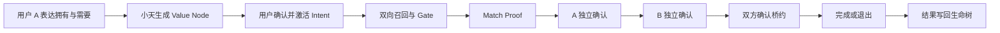

# 天使桥 AngelBridge｜黑客松 MVP PRD

> 版本：v2.0（精简执行版）  
> 日期：2026-08-26  
> 产品形态：移动端优先的响应式 Web / PWA  
> 开发周期：96 小时以内  
> 数据边界：只使用明确标注的虚构角色与合成数据  
> 团队表达：只保留五个角色席位，不出现成员姓名  
> 关联文档：[Idea 打磨与产品方案](天使桥_Idea打磨与产品方案.md)｜[设计稿问题评审](天使桥_当前设计稿问题评审.md)｜[路演 Deck 大纲](天使桥_路演Deck大纲.md)

---

## 1. 产品与本次目标

### 1.1 一句话定义

> **天使桥帮助拥有资源、能力或愿望的人，由个人 AI“小天”理解双方能提供什么、需要什么、愿意怎样交换，促成可信、双向有益且可以立即开始的价值置换、资源交换与现实连接。**

### 1.2 本次 MVP 要证明什么

> **同一套价值模型，能否把不同类型的资源与愿望转成结构化 Intent，再通过双方各自的小天，形成可解释、经双方同意并能采取行动的连接。**

MVP 证明的是产品机制，不证明已经拥有真实用户规模、真实资源或真实撮合成果。

### 1.3 主演示案例

**空间 × 服务**

- 用户 A：周末有一间闲置工作室，需要一组品牌照片；
- 用户 B：需要两天拍摄场地，可以提供品牌摄影；
- 天使桥生成桥约：两天工作室使用权换一组品牌照片。

另外两个合成案例只快速展示结果，用来证明同一底层能力可以复用：

- **能力 × 机会：** 产品运营能力连接技术合作机会；
- **志趣 × 成长：** 摄影教学交换英语陪练。

### 1.4 完成标准

MVP 同时满足以下条件才算完成：

1. 手机和电脑都能打开部署链接；
2. 用户 A 能从自然语言生成并确认 Value Node 与 Intent；
3. 系统能返回少量双向候选并展示 Match Proof；
4. 用户 A、用户 B 能在两台设备上分别确认；
5. 只有双方同意后才能生成桥约；
6. 桥约完成后，结果能写回简版生命树；
7. 主案例能在 3 分钟内完整运行；
8. 所有角色、资源和结果都明确标注为模拟数据。

---

## 2. Stakeholders 与交互路径

### 2.1 Stakeholders

| 角色 | 目标 | 在产品中的行为 |
|---|---|---|
| 发起方用户 A | 表达拥有与需要，找到双向成立的对象 | 创建节点、激活 Intent、查看候选、确认桥约 |
| 候选方用户 B | 判断连接是否也对自己有价值 | 查看 Match Proof、接受或拒绝、确认桥约 |
| 评委 / 体验者 | 快速理解创新、技术与完成度 | 观看双端 Demo，或操作合成体验链接 |
| Demo 操作方 | 保证演示可重复 | 创建 Session、打开 A/B 链接、重置案例 |
| 五个团队席位 | 在 96 小时内完成产品与路演 | 设计、开发、联调、测试和提交 |

### 2.2 主交互路径



### 2.3 Presenting 路径

评委应依次看到：

1. 一段复杂表达被整理成统一价值结构；
2. 候选结果同时解释双方分别获得什么；
3. 两端用户分别作出决定，AI 不替人同意；
4. 推荐结果继续变成一份可执行桥约；
5. 行动结果回到生命树，形成持续成长记录；
6. 另外两个案例复用同一 Schema、API 和组件。

---

## 3. MVP 范围

### 3.1 P0：必须完成

| 模块 | 功能 |
|---|---|
| Demo Session | 创建、选择案例、生成 A/B 链接、重置状态 |
| 小天输入 | 提交预填的合成自然语言，展示处理进度 |
| 节点确认 | 编辑、删除、确认 Value Node 及可见范围 |
| Intent | 选择 Offer、Need、交换方式和硬约束并激活 |
| 简版生命树 | 展示拥有、需要、当前愿望和行动结果 |
| 双向匹配 | 双向召回、硬条件 Gate、内部排序、Top 3 |
| Match Proof | 双方收益、证据、冲突、未知项和建议第一步 |
| 双端确认 | A/B 分别接受或拒绝，状态实时同步 |
| 桥约 | 双方提供与获得、时间地点、第一步、完成标准 |
| Outcome | 完成或退出，并把结果写回生命树 |
| Demo 标识 | 所有页面持续显示“模拟数据” |

### 3.2 P1：P0 稳定后再做

- 浏览器语音转文字；
- 小天灵宠外观选择；
- 生命树生长动画；
- “需要补充信息”的单轮交互；
- PWA 添加到桌面提示。

### 3.3 本次不做

- 真实用户注册和真实个人资料；
- 真实房源、招聘、婚恋、交易与支付；
- 自动向真人发送消息；
- 新闻平台、全网抓取和持续后台 Agent；
- 点赞、粉丝、热榜和内容瀑布流；
- Token、会员、商业化和后台运营系统；
- 多个自治 Agent 集群；
- 原生 iOS、Android APP。

---

## 4. 信息架构与页面

### 4.1 用户端导航

底部保留四个入口：

1. **小天：** 表达、结构化确认和下一步；
2. **生命树：** 我拥有、我需要和成长结果；
3. **搭桥：** 当前 Intent、候选桥和 Match Proof；
4. **桥信：** 待确认连接、桥约和结果。

不设置“关注、发现、热门、点赞”等内容社区入口。

### 4.2 页面清单

| 页面 | 建议路由 | 主要功能 |
|---|---|---|
| Demo 操作台 | `/demo` | 创建 Session、选择案例、生成 A/B 链接、重置 |
| 小天 | `/s/[session]/[role]/angel` | 自然语言输入、处理进度、节点确认 |
| 生命树 | `/s/[session]/[role]/tree` | 拥有、需要、愿望、成长结果 |
| 搭桥列表 | `/s/[session]/[role]/bridges` | 当前 Intent、Top 3 候选 |
| Match Proof | `/s/[session]/[role]/bridges/[id]` | 双方收益、证据、冲突、未知项、确认 |
| 桥信 | `/s/[session]/[role]/inbox` | 待我确认、等待对方、进行中、已结束 |
| 桥约 | `/s/[session]/[role]/pacts/[id]` | 约定、双方确认、开始、完成或退出 |

### 4.3 页面要点

#### Demo 操作台

- 三个合成案例；
- 创建独立 Session；
- A/B 两个链接或二维码；
- 当前阶段和重置按钮。

#### 小天与节点确认

- 预填合成自述；
- “让小天整理”按钮；
- AI 生成的 Offer、Need、Goal 节点；
- 节点编辑、可见范围和确认；
- 至少确认一个 Offer 和一个 Need 后才能激活 Intent。

#### 简版生命树

- 左侧：我拥有和能提供；
- 右侧：我需要和正在寻找；
- 中间：当前激活的 Intent；
- 行动完成后新增一朵花或一枚果实；
- P0 使用 SVG 与卡片组合，不做复杂图算法。

#### 搭桥列表

- 当前 Intent 摘要；
- 最多三个候选；
- 每张卡先显示“你获得什么、对方获得什么”；
- 不显示无法解释的匹配百分比。

#### Match Proof

固定展示：

1. 你需要的，如何被对方提供；
2. 你能提供的，如何回应对方需要；
3. 已满足条件；
4. 合成证据；
5. 冲突和未知项；
6. 小天建议的第一步；
7. 接受或拒绝。

#### 桥信

- A 接受后，B 收到一条待确认桥信；
- B 接受后，双方出现桥约入口；
- 使用 Supabase Realtime 同步；若时间不足可改为短轮询；
- 不开发自由聊天。

#### 桥约与 Outcome

- 双方各自提供和获得什么；
- 时间、地点与费用；
- 第一次行动；
- 完成标准和退出方式；
- 双方确认后进入 `active`；
- 完成后生成 Outcome 并更新生命树。

---

## 5. 核心规则与数据

### 5.1 状态主线

```text
Intent 草稿
→ 用户激活
→ 候选生成
→ A 接受
→ B 接受 / 拒绝
→ 桥约草稿
→ 双方确认
→ 开始行动
→ 完成 / 退出
→ 写回生命树
```

前端只展示服务端状态；双方同意、桥约激活和结果写回都由后端状态机处理。

### 5.2 匹配规则

```text
双向召回：A.need → B.offer，同时 A.offer → B.need
硬条件 Gate：类型、时间、地点、交换方式和可见范围
内部排序：双向效用 × 证据完整度 × 新鲜度
```

- 向量负责召回，规则负责硬条件；
- LLM 负责结构化理解与解释草稿，不直接决定业务状态；
- UI 展示证据、冲突和未知项，不展示黑箱总分；
- 任何一方没有明确收益时，不生成“推荐桥”。

### 5.3 核心数据实体

| 实体 | 作用 |
|---|---|
| `demo_sessions` | 隔离一次演示及其状态 |
| `personas` | 当前 Session 中的 A/B 虚构角色 |
| `value_nodes` | Offer、Need、Goal 与可见范围 |
| `intents` | 一次价值置换或资源连接意图 |
| `matches` | 双向候选、Gate 结果与 Match Proof |
| `consents` | A/B 各自的决定 |
| `bridge_pacts` | 双方行动约定与状态 |
| `outcomes` | 完成、退出和生命树变化 |

所有数据带 `is_synthetic = true` 和 `dataset_version`。原始自然语言不持久化。

### 5.4 核心 API

| API | 作用 |
|---|---|
| `POST /api/demo/sessions` | 创建合成 Demo Session |
| `POST /api/demo/sessions/:id/reset` | 重置 Session |
| `POST /api/ai/parse` | 解析 Value Node 与 Intent 草稿 |
| `PATCH /api/value-nodes/:id` | 编辑和确认节点 |
| `POST /api/intents/:id/activate` | 激活 Intent |
| `GET /api/intents/:id/matches` | 获取候选与 Match Proof 摘要 |
| `POST /api/matches/:id/consents` | 提交当前角色决定 |
| `GET /api/personas/:id/inbox` | 获取桥信状态 |
| `POST /api/pacts/:id/confirm` | 确认桥约 |
| `PATCH /api/pacts/:id/status` | 开始、完成或退出 |
| `GET /api/personas/:id/tree` | 获取生命树与 Outcome |

开发前先冻结三份 JSON Fixture：`ParseResult`、`MatchProof`、`BridgePact`。前端用它们做 Mock，后端和 AI 按同一结构实现真实接口。

---

## 6. 技术选型

### 6.1 前端

- Next.js App Router + TypeScript；
- Tailwind CSS + shadcn/ui；
- TanStack Query 管理接口状态；
- Supabase Realtime 同步 A/B 状态；
- SVG/CSS 绘制简版生命树；
- PWA Manifest 提供手机桌面体验。

### 6.2 后端与 AI

- Next.js Route Handlers，单仓单体；
- Supabase PostgreSQL + pgvector；
- Zod 统一校验接口与模型输出；
- OpenAI-compatible 中文模型 API；
- SQL Gate + Offer/Need 双向向量召回；
- Vercel + Supabase 部署。

### 6.3 技术边界

- 不拆微服务；
- 不开发复杂多 Agent；
- 小天在服务端表现为一个编排式 Agent；
- 合成候选的 embedding 提前生成；
- 主案例可保留一份明确标注的预置结构化输出，保证展示可复现。

---

## 7. 五个角色席位

每个席位对应一名正式参赛成员。每项工作只有一个主责席位，交叉能力用于支援，不形成多人共同负责。

### R1｜后端 / AI 开发

**主责：**

- 设计数据库、业务状态机和 API；
- 接入模型并实现自然语言结构化抽取；
- 实现双向召回、Gate、排序和 Match Proof；
- 实现 Consent、Bridge Pact、Outcome 和 Realtime；
- 管理 Supabase、模型配置和生产部署。

**独立产出：** Schema、Prompt、评测集、API、Migration、Seed 和线上环境。

### R2｜前端开发

**主责：**

- 搭建 Next.js Web/PWA 和组件库；
- 实现七个页面、客户端状态和移动端适配；
- 根据 Fixture 先完成 Mock 流程；
- 接入真实 API、Realtime 和 PWA；
- 负责前端构建、Preview 和浏览器验收。

**独立产出：** 可交互 Web/PWA、组件、接口调用层和响应式页面。

### R3｜UI/UX 交互设计

**主责：**

- 梳理 A/B 双端用户旅程和信息架构；
- 输出七个页面的低保真原型与状态表；
- 明确每个页面的入口、操作、反馈和完成状态；
- 设计生命树、Match Proof、双端确认和桥约体验；
- 与 R5 确认业务逻辑，与 R2 确认可实现性。

**独立产出：** 用户流程图、低保真原型、页面状态表和交互说明。

### R4｜UI 视觉 / 美工

**主责：**

- 建立 Logo、颜色、字体、卡片、图标和组件视觉规范；
- 将低保真原型转为关键页面高保真 UI；
- 输出小天形象、生命树、合成头像、插图和前端素材；
- 负责产品截图、海报、Demo 视频包装和 Deck 美化；
- 检查手机和投屏画面的视觉完成度。

**独立产出：** 高保真 UI、视觉规范、设计资源包、产品截图和视频视觉素材。

### R5｜产品统筹 / 路演

**主责：**

- 冻结产品定位、MVP 范围和业务规则；
- 拆解任务、维护进度表和 P0 阻断列表，及时砍需求；
- 对接主办方并协调设计、前端和后端依赖；
- 编写 PRD、作品描述、Deck、路演稿和答辩材料；
- 验收产品主路径，组织 Demo 排练和最终提交。

**独立产出：** PRD、任务排期、决策记录、验收标准、Deck、路演稿、Demo Runbook 和提交清单。

### 7.1 决策与代码边界

| 范围 | 最终负责人 |
|---|---|
| 服务端、模型、数据库和发布 | R1 |
| 客户端架构与前端合并 | R2 |
| 用户旅程、信息架构和交互状态 | R3 |
| UI 视觉、设计素材和视频画面 | R4 |
| 产品范围、进度、路演和最终提交 | R5 |

两位设计角色明确分开：R3 决定流程与交互，R4 决定视觉与素材，R2 负责实现。R5 不代替设计和开发，只负责范围、协调、验收与讲述。

---

## 8. 怎么并行工作

### 8.1 0–6 小时：五人共同冻结

全员一起完成：

- 确认主演示路径；
- 冻结 Value Node、Intent、Match Proof、Bridge Pact；
- 冻结 `ParseResult`、`MatchProof`、`BridgePact` 三份 Fixture；
- 确认七个页面和主案例预期结果；
- 建立代码仓库、任务板和 Preview 环境。

完成后进入五条并行工作流。

### 8.2 6–28 小时：五条并行工作流

| 席位 | 独立工作 | 交给谁 |
|---|---|---|
| R1 后端/AI | 数据库、Seed、Session、模型解析、匹配和状态 API | 向 R2 提供接口、Fixture 和 Preview 环境 |
| R2 前端 | 按 Fixture 完成组件、页面和 Mock 主流程 | 接收 R3/R4 设计，并与 R1 联调真实接口 |
| R3 UI/UX 交互 | 用户旅程、低保真原型、页面状态和交互说明 | 向 R4 交付视觉基础，向 R2 交付实现说明 |
| R4 UI 视觉/美工 | 视觉系统、高保真 UI、小天和生命树素材 | 向 R2 交付设计资源，向 R5 交付路演视觉 |
| R5 产品统筹/路演 | 产品规则、任务排期、验收案例、Deck 骨架和讲述主线 | 向全员提供范围与优先级，持续收集产品和技术素材 |

此阶段前端不等待后端，后端不等待完整 UI，双方都以冻结 Fixture 为准。

### 8.3 并行工作的接口

```text
R5 决定“做什么、为什么、何时完成”
        ↓
R3 设计“用户流程怎样走”
        ↓
R4 定义“页面看起来是什么样”
        ↓
R2 实现前端操作 ← JSON Fixture / API → R1 实现数据、业务和 AI
        ↓
R5 将真实产品结果组织成 Demo 与路演
```

---

## 9. 怎么联合与联调

### 联调一｜28–40 小时：输入到 Intent

```text
创建 Session → 提交合成文本 → 返回节点 → 编辑确认 → 激活 Intent
```

- R1 提供 Preview API 并处理模型结构化结果；
- R2 将 Mock 切换为真实接口；
- R3 检查输入、节点确认和 Intent 激活是否顺畅；
- R4 检查节点层级、反馈状态和视觉一致性；
- R5 按验收脚本走查，判断 AI 是否正确理解产品含义并记录阻断。

**通过条件：** 主案例连续运行三次，无阻断。

### 联调二｜40–58 小时：Intent 到 Match Proof

```text
激活 Intent → 双向召回 → Gate → Top 3 → Match Proof
```

- R1 提供候选顺序、Gate 结果和 Match Proof；
- R2 完成候选列表、详情、加载和空状态；
- R3 检查信息结构和交互路径是否易懂；
- R4 检查证据、冲突和未知项的视觉层级；
- R5 验收“双向价值”是否成立，并同步提炼路演中的技术解释。

**通过条件：** 三个案例使用同一接口，主演示候选稳定排在第一。

### 联调三｜58–72 小时：两端确认到生命树

```text
A 接受 → B 收到桥信 → B 接受 → 生成桥约
→ 双方确认 → 完成行动 → 生命树更新
```

- R1 负责 Consent、Pact、Realtime 和 Outcome；
- R2 用两台设备完成状态同步和页面操作；
- R3 检查 A/B 双端确认、桥约和生命树的体验衔接；
- R4 检查桥约与生命树的视觉反馈和投屏效果；
- R5 按 Demo Runbook 计时走完全流程，决定是否达到 P0、是否冻结功能。

**通过条件：** 新 Session 能在 3 分钟内完成主演示。

### 9.1 日常协作规则

- 每 12 小时一次 15 分钟同步，只讲完成、阻断和下一里程碑；
- R5 维护唯一任务板和 P0 阻断列表；
- Schema 或 Fixture 改动由 R1、R2 确认可实现，R5 确认业务含义；
- 每完成一段纵向闭环立即部署 Preview；
- 第 72 小时后冻结功能，只修主路径；
- 每天至少完整跑一次两台设备 Demo。

---

## 10. 96 小时开发计划

| 时间 | 目标 | 主责 | 联合验收 |
|---|---|---|---|
| 0–6h | 范围、用户流程、Schema、Fixture 冻结 | R5、R3、R1 | R2、R4 共同确认 |
| 6–16h | 前后端骨架、低保真、视觉系统、Deck 骨架 | R1–R5 各自并行 | R5 组织走查 |
| 16–28h | Mock 页面、解析服务、高保真与产品文案 | R1、R2、R3、R4 | R5 验收 |
| 28–40h | 第一次联调：输入到 Intent | R1、R2 | R3、R4、R5 |
| 40–58h | 第二次联调：匹配与 Match Proof | R1、R2 | R3、R4、R5 |
| 58–72h | 第三次联调：Consent、桥约、Outcome | R1、R2 | R3、R4、R5 |
| 72–84h | 前后端稳定、移动端优化、视觉完成 | R1、R2、R3、R4 | R5 冻结 P0 |
| 84–92h | 录屏、截图、Deck 和答辩排练 | R4、R5 | R1–R3 提供支持 |
| 92–96h | README、Tag、体验链接和提交 | R5 | 全员核对 |

时间不足时按顺序删除：语音、灵宠换装、生命树动画、补充信息分支、PWA 安装提示。不得删除双向 Match Proof、两端确认、桥约和结果写回。

---

## 11. 验收与 Demo

### 11.1 P0 验收清单

- [ ] 可创建、重置独立 Demo Session；
- [ ] A/B 链接不会串角色或串 Session；
- [ ] 合成文本能生成并确认 Value Node 与 Intent；
- [ ] 三个案例共用同一匹配 API；
- [ ] Match Proof 同时说明双方收益；
- [ ] A/B 未共同同意时不能激活桥约；
- [ ] 桥约完成后生命树出现变化；
- [ ] 手机、电脑和投屏均可操作；
- [ ] 页面持续显示模拟数据；
- [ ] 主演示连续运行五次无阻断。

### 11.2 三分钟 Demo

| 时间 | 演示内容 | 评委应获得的结论 |
|---|---|---|
| 0:00–0:30 | A 向小天提交合成自述 | AI 理解复杂人生意图 |
| 0:30–0:55 | 确认节点与 Intent | 用户控制事实和边界 |
| 0:55–1:25 | 查看候选与 Match Proof | 这是双向价值，不是黑箱推荐 |
| 1:25–1:55 | A 接受，B 独立接受 | 两个 Agent 各自代表主人 |
| 1:55–2:30 | 生成并确认桥约 | 连接继续变成现实行动 |
| 2:30–2:50 | 完成并查看生命树 | 行动结果形成成长记录 |
| 2:50–3:00 | 切换两个预置案例 | 同一底座可连接多种价值 |

演示开场必须说明：人物、资源和结果均为合成数据，本次证明的是机制与闭环，不宣称真实撮合成果。

---

## 12. 最终交付

- 可 build、可运行的 Next.js Web/PWA；
- 手机与电脑可访问的 Demo 链接；
- A/B 两端的完整成桥流程；
- 三个共用 Schema、API 与组件的合成案例；
- GitHub 仓库与赛事 Tag；
- README、产品文档和实际产品截图；
- 演示视频与路演 Deck；
- 已完成的 P0 验收清单。

---

## 结论

本次开发只保护一条主线：

> **用户表达拥有与需要 → 小天形成 Intent → 系统发现双向价值 → 两端分别同意 → 生成桥约 → 行动结果写回生命树。**

五个席位分别拥有产品、视觉、前端、AI/后端和交付的主责，在冻结的 Fixture 上并行开发，在三次纵向联调中合流。任何新功能都不能挤占这条闭环。
